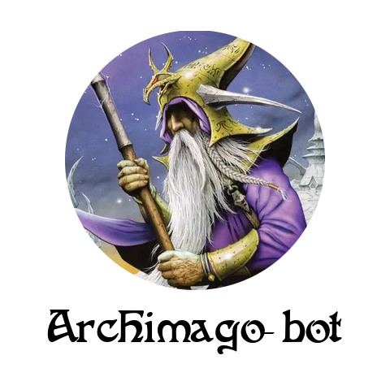

<p align="center">
  
</p>

The wizard of the Finnish Sorcery TCG [discord server](https://discord.gg/en3tmeSGGv). A discord bot that web-scrapes [curiosa.io](https://curiosa.io/) for deck recipes and the official API for card information! Full command documentation is under the `COMMANDS.md` file.

## Installation

As usual with python programs fetching required rependencies can be done with `pip` by running

```
pip install -r requirements.txt
```

After installing the depdendencies, the program will when first run make sure that chromedriver is installed to your path. Alternatively, you can also provide your own instance of a webdriver when interacting with `curiosa.py`.

The program also caches the cards data that can be retrieved from [curiosa.io API](https://api.sorcerytcg.com/). For `card` CLI command to work, first run

```
python curiosa.py download
```

which then downloads the `cards.json` file into the data folder.

## Usage

Although the main usage is to have this function as bot on the Finnish sorcery server, the program can also be run as a CLI. For instance fetching a deck by ID can be done by

```
python curiosa.py id <your_deck_id_here>
```

which webscapes the deck and then prints your deck list a string. Running

```
python curiosa.py --help
```

will get you started on interacting with the program through CLI. If you want to add the bot to your own server, you can invite it with this [link](https://discord.com/api/oauth2/authorize?client_id=1297139330279669820&permissions=2048&scope=bot%20applications.commands).

**NOTE**: this bot can handle single requests at a time, it does no buffering/pooling and thus if a command is given when the bot is processing another command, it will not be able to handle that request.

**NOTE 2**: this bot doesn't accept web-scraping commands through private messaging due to reason above.

## License

This repository is licensed under the MIT license.