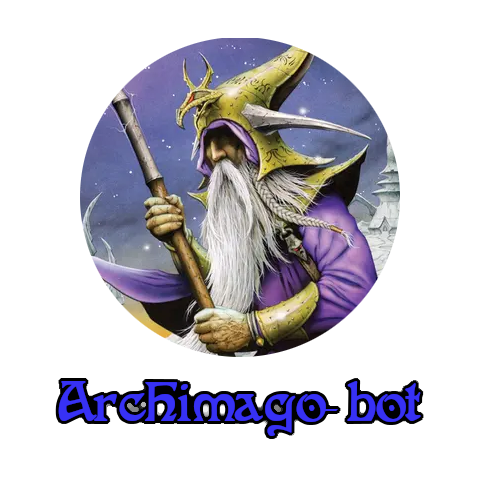

<p align="center">
  
</p>

The wizard of the Finnish discord server. A discord bot that web-scrapes [curiosa.io](https://curiosa.io/) for deck recipes and the official API for card information! Full command documentation is under the `COMMANDS.md` file.

## Installation

As usual with python programs fetching required rependencies can be done with `pip` by running

```
pip install -r requirements.txt
```

after installing, it is necessary to have a `chromedriver.exe` in a folder called `driver` at the projects root for the project to work. You can also provide your own instance
of a webdriver when interacting with `curiosa.py`.

## Usage

Although the main usage is to have this function as bot on the Finnish sorcery server, the program can also be run as a CLI. For instance fetching a deck by ID can be done by

```
python main.py id <your_deck_id_here>
```

which webscapes the deck and then prints your deck list a string. Running

```
python main.py --help
```

will get you started on using the program through CLI. If you want to add the bot to your own server, you can invite with this [link](https://discord.com/api/oauth2/authorize?client_id=1297139330279669820&permissions=2048&scope=bot%20applications.commands).

## License

This repository is licensed under the MIT license.